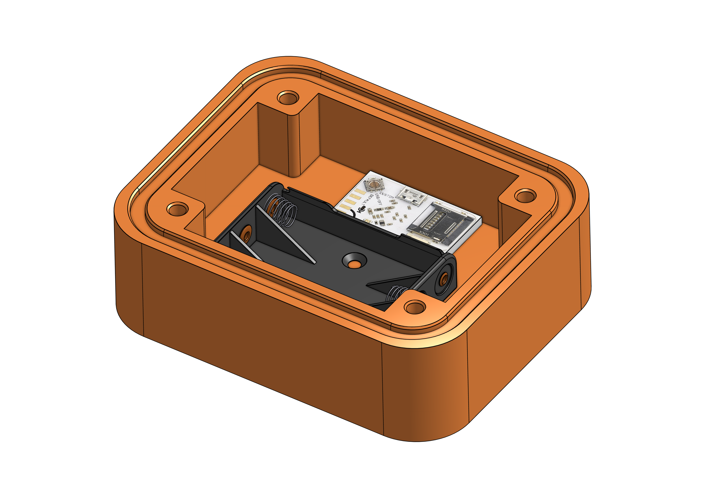
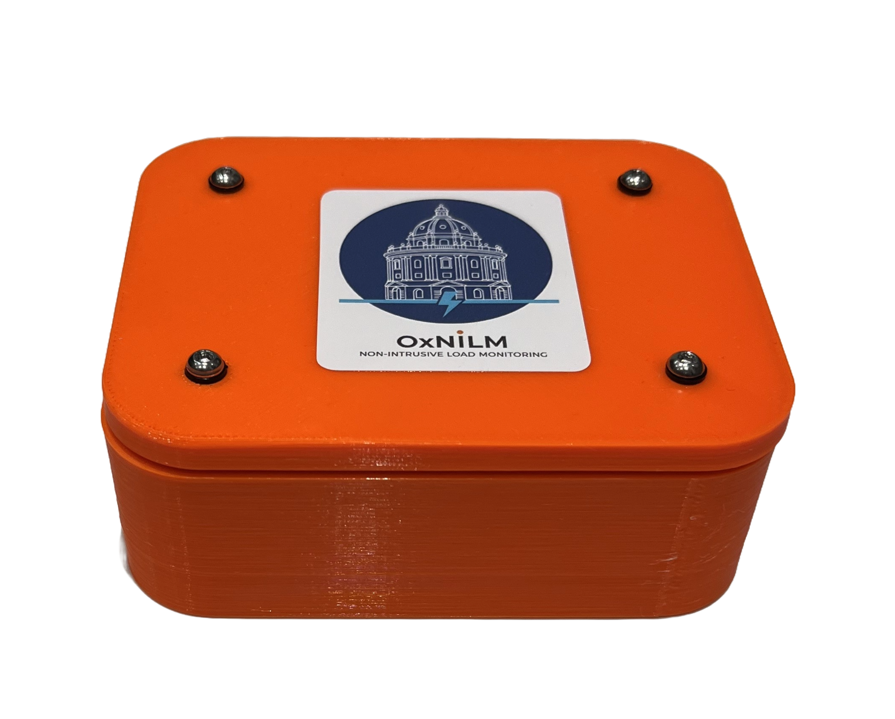
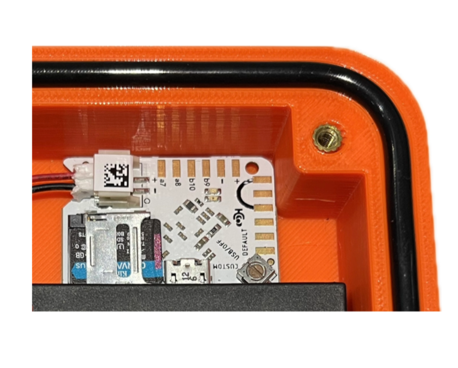
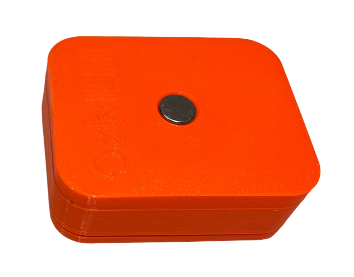

# nilm-case-cad

CAD files, hardware specifications, and assembly details for a waterproof MicroMoth enclosure developed for acoustic Non-Intrusive Load Monitoring (NILM).

## Bill of Materials

| Item | Description | Quantity |
| :--- | :--- | :--- |
| **Printed parts** | PETG enclosure body and lid | 1 |
| **O-ring** | Nitrile, 90 mm internal diameter × 4 mm cross-section | 1 |
| **Screws** | M3 × 12 mm A2 stainless steel | 4 |
| **Thread inserts** | Brass heat-set, M3 | 4 |
| **Washers** | M3 nylon flat washers | 4 |
| **Magnet** | Neodymium (NdFeB) 15 mm × 5 mm (press-fit) | 1 |

## Assembly Instructions

1. **Heat-Set Inserts**: Press the 4× M3 brass heat-set inserts into the receiving bosses on the main PETG body using a soldering iron set to approximately 230–250°C.
2. **Magnet Fit**: Press-fit the 15 mm × 5 mm Neodymium magnet into the designated recess on the enclosure casing.
3. **Seal Installation**: Seat the 90 mm × 4 mm Nitrile O-ring into the perimeter sealing channel, ensuring it sits flush without twists.
4. **Final Closure**: Align the lid, place the M3 nylon flat washers over the screw holes, and secure using the 4× M3 × 12 mm stainless steel screws in a diagonal pattern to ensure uniform pressure across the seal.

## File Formats

* `.STEP` / `.STP` format for direct CAD editing and version control.

## Images of Assembled Case

<figure>
  
  <figcaption>Case with lid attached</figcaption>
</figure>

<figure>
  
  <figcaption>Close-up of MicroMoth in case with lid removed</figcaption>
</figure>

<figure>
  
  <figcaption>Base of case with embedded magnet</figcaption>
</figure>

